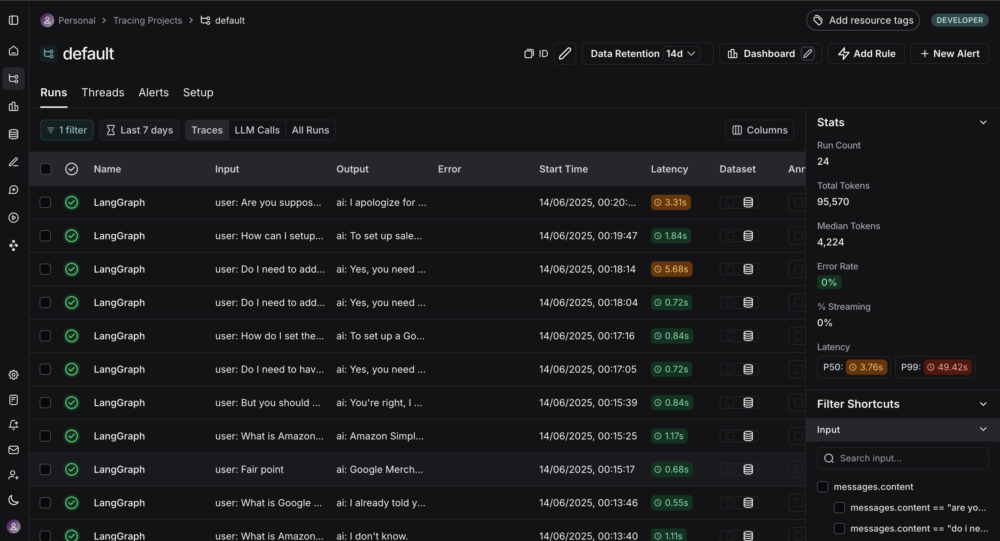

# Onboarding Agent

## Project Background
This project was completed as part of the undergraduate course *Practical Application of Artificial Intelligence* at the Faculty of Electrical Engineering, University of Sarajevo, within the Department of Data Science and Artificial Intelligence. As part of the course led by Professor Kenan Sehic, Rijalda Sacirbegovic and Almir Mustafic were tasked with developing a group project that addresses a real-world problem using AI. Our project focuses on reducing the manual workload of a customer support team at the company we work for. The company manages dozens of applications and handles a high volume of daily inquiries — ranging from installation guidance to advanced product customization (e.g., banners, margins, sales settings, etc.). Also, frequent product updates require constant manual revisions to support documentation. Our AI-based support agent aims to reduce the number of incoming tickets by automatically addressing common and repetitive user queries.

## About the Onboarding Agent
The idea behind our agent is straightforward. Each time the manual is updated, the latest version is uploaded to the application. The old manual data is removed from the database, and the new content is vectorized and stored.

## Technologies
This application leverages an AI-powered architecture built primarily using the LangChain framework to enable dynamic document-based question answering. The system integrates several technologies and services. It uses Groq’s LLMs (e.g., LLaMA3-8B-8192) for natural language generation, alongside MistralAI’s embedding models for semantic search and vector similarity operations. The manuals are vectorized using these embeddings and stored in an in-memory vector database for quick retrieval. 
To manage and structure the flow of logic, the system utilizes LangGraph’s StateGraph to define a multi-node conversational workflow that processes inputs, determines whether to trigger tool usage (e.g., document retrieval), and then creates responses based on contextual information. 
Document ingestion is handled through a DOCX parser (via python-docx), and documents are split into chunks using LangChain’s RecursiveCharacterTextSplitter. The system ensures that each manual update reflects the most current application state. The database is cleared every time the application is started and the data is replaced with updated embeddings.
The API keys (LangSmith, Groq, Hugging Face, and Mistral) are fetched from the .env file.
Package dependencies are validated and installed at runtime, ensuring the system is equipped with libraries such as langchain_community, beautifulsoup4, and pandas.
All interactions and updates are traced via LangSmith for observability. The inclusion of LangGraph's memory checkpointing feature (MemorySaver) enables persistent thread tracking and debugging — similar in nature to version control systems like Git — making this application maintainable.

## Requirements
This project is built and tested with **Python 3.10+**.

## Setup
Create the virtual environment (from the project root):
```bash
python3.12 -m venv .venv
```
Activate the virtual environment:
```bash
source .venv/bin/activate
```
Deactivate the virtual environment (when you're done):
```bash
deactivate
```
Add LangSmith, Groq, Hugging Face, and Mistral keys in the .env file.

## Run the project
Start the application by running (from the project root):
```bash
python main.py 
```
Wait until the debugger is activated and the server is ready. Open your browser and navigate to:
```
http://192.168.0.19:5001/
```
Enter prompts in the interface — the agent will respond with answers.

## How to use the application
When the application is started (see description below), it can be accessed via link provided in the terminal and it is http://192.168.0.19:5001/. There is nothing that customers or the support team need to do. The customers can start prompting the agent and the agent will be responding immediately.

## Frontend
The frontend of the application is built using Python Flask, providing a lightweight and responsive web interface for interacting with the agent. It uses a simple HTML form rendered via Jinja2 templates, allowing users to submit natural language queries from the browser. Upon form submission, the input is passed to the backend, where it is handled by the LangGraph-powered agentic workflow. The resulting response is then displayed on the same page, ensuring an interaction loop. This synchronous request-response flow makes it easy to test and iterate on prompt engineering or agent behavior in real-time. The Flask server is configured to run in development mode (`debug=True`) and is accessible on `localhost:5001`, making it suitable for local demos. Here is how the frontend looks like:


## Evaluate agent
Run the evaluation script:
```bash
python model_eval.py
```
Click on the link that is generated in the terminal
or open the link in your browser to view the evaluation dashboard.

## Agent Evaluation Overview
In order to ensure the accuracy of the agent’s final responses, we leverage LangSmith’s evaluation framework. A dataset of sample question–answer pairs is created to represent typical user interactions with the onboarding agent. Each example is evaluated using an LLM-as-a-judge methodology.
The grading model—llama3-70b-8192 is configured for structured output and follows evaluation criteria. It receives the user question, the ground truth answer, and the agent’s response. The model then determines whether the response is factually accurate, allowing for additional information as long as it does not conflict with the expected answer.
Once completed, LangSmith provides a link to the evaluation results. Some of the metrics can be seen below (influenced by free third-party service limitations):




## Known Limitations and Areas for Improvement
The free-tier version of the used third-party services provides a limited token quota, which may cause the agent to slow down after several prompts due to quota limit. During evaluation, you might occasionally encounter "bad request" errors caused either by quota limits (specified in the error) or by the grader’s responses not matching the expected format required by LangSmith. Initially, the errors due to incorrect formatting occurred consistently, but after multiple iterations and prompt tuning, we achieved reliable, correctly formatted outputs. Additionally, when working with larger manuals, the in-memory vector database currently in use can lead to performance issues since it is frequently refreshed. This refresh process—re-ingesting, generating embeddings, and reinserting data—can introduce delays.

## Next steps
The application will support two modes: Automatic and Manual. In Automatic mode, the agent responds to customer queries immediately. In Manual mode, a sound notification alerts the support team of a new request, and the customer is informed that the first available agent will respond shortly. This mode allows the support team to review and edit responses before sending them. Additionally, the application should support automatic translation of responses based on the customer’s location. In automatic mode, translations occur without intervention. In manual mode, the support team selects the target language before responding.
All conversations between customers and the support team will be stored in a separate knowledge database. This data will be used to complement the main manual during the next scheduled update. If the app owner does not perform the update within 7 days, a background process will automatically trigger it.
Rather than relying on an in-memory vector database, the application should use a persistent (external) vector database for storing and retrieving embeddings. The next release will also include a dedicated page for manual uploads to make the app more user-friendly.

## Contact
For questions or collaboration, please reach out to:

- **Almir Mustafic** — [email](mailto:amustafic6@etf.unsa.ba) | LinkedIn: [almir](https://www.linkedin.com/in/almir-mustafi%C4%87-377aa538)

- **Rijalda Sacirbegovic** — [email](mailto:rsacirbego1@etf.unsa.ba) | LinkedIn: [rijalda](https://www.linkedin.com/in/rijalda-%C5%A1a%C4%87irbegovi%C4%87-619a33289/)

## License
This project is licensed under the [MIT License](./LICENSE).

## Acknowledgments
This project uses the following third-party libraries, models, and services:

- [OpenAI API](https://openai.com/) — used via LangChain, subject to [OpenAI Terms of Use](https://openai.com/policies/terms-of-use).
- [Mistral models](https://mistral.ai/) — used via `langchain_mistralai`, licensed under the [Apache 2.0 License](https://www.apache.org/licenses/LICENSE-2.0).
- [LangChain](https://www.langchain.com/) — [MIT License](https://github.com/langchain-ai/langchain/blob/master/LICENSE).
- [LangSmith](https://www.langchain.com/langsmith) — subject to [LangChain Terms of Use](https://www.langchain.com/legal/terms).
- [LangGraph](https://github.com/langchain-ai/langgraph) — [MIT License](https://github.com/langchain-ai/langgraph/blob/main/LICENSE).
- [Groq API](https://groq.com/) — used as an LLM provider; subject to [Groq Terms of Use](https://groq.com/legal/terms/).
- [Meta LLaMA 3](https://ai.meta.com/llama/) — model weights licensed under the [Meta LLaMA 3 License](https://ai.meta.com/llama/license/).
- [BeautifulSoup4](https://www.crummy.com/software/BeautifulSoup/) — [MIT License](https://github.com/wention/BeautifulSoup4/blob/master/LICENSE).
- [Flask](https://flask.palletsprojects.com/) — [BSD-3-Clause License](https://github.com/pallets/flask/blob/main/LICENSE.rst).
- [pandas](https://pandas.pydata.org/) — [BSD License](https://github.com/pandas-dev/pandas/blob/main/LICENSE).
- [python-docx](https://github.com/python-openxml/python-docx) — [MIT License](https://github.com/python-openxml/python-docx/blob/master/LICENSE).
- [python-dotenv](https://github.com/theskumar/python-dotenv) — [BSD-3-Clause License](https://github.com/theskumar/python-dotenv/blob/master/LICENSE).

Please refer to each tool’s respective license and terms for detailed usage rights.

## Disclaimer
The example of the manual used in this project is for testing and demonstration purposes only. It does not represent official documentation or advice.